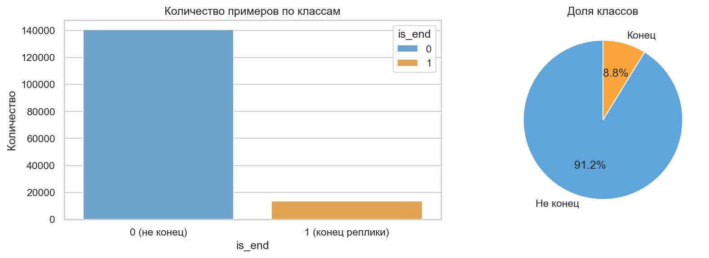
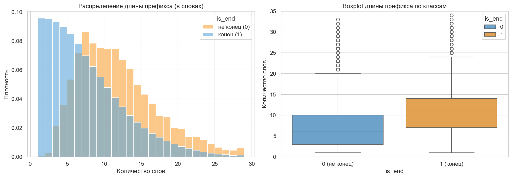
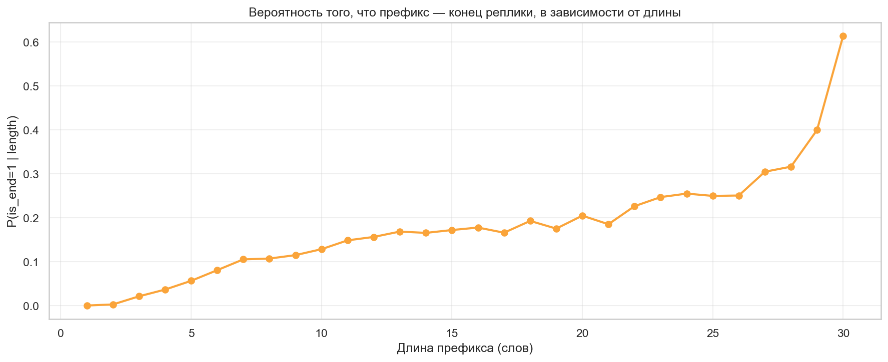
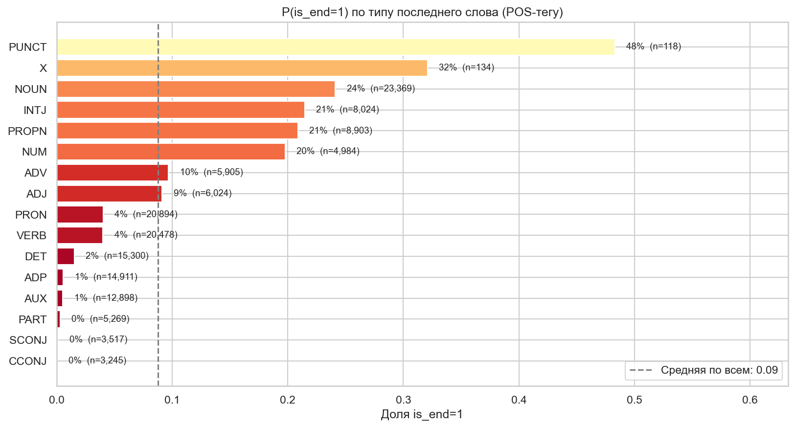
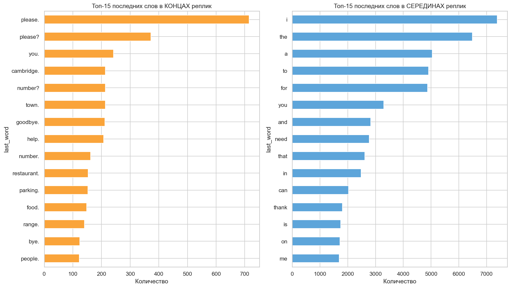
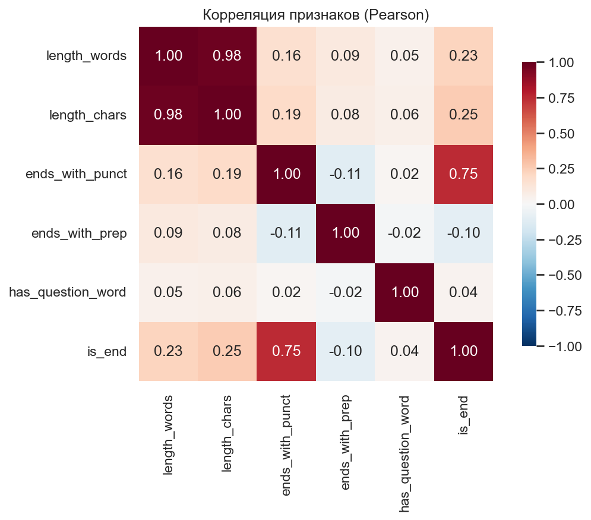

# Промежуточный отчёт — Turn Detector

**Автор:** Талгат Букенов
**Курс:** AI Engineer — Machine Learning, март 2026

---

## 1. Цель проекта

Разработка модели **детекции конца реплики** (end-of-turn detection) для
голосовых AI-агентов. Модель по тексту префикса реплики пользователя
предсказывает, закончил он свою мысль или ещё договорит. Это позволит
голосовому боту отвечать без задержки и не перебивать пользователя — двух
главных проблем современных голосовых систем.

Задача актуальна для всех, кто строит голосовых агентов: колл-центры,
банки, доставка, медтех, edtech.

## 2. Источник данных

**[MultiWOZ 2.2](https://huggingface.co/datasets/pfb30/multi_woz_v22)** —
открытый датасет диалогов между пользователями и операторами по
бронированию отелей, ресторанов, такси и других услуг.

- Объём: ~8 400 диалогов в train-сплите
- Использовано в EDA: первые 2000 диалогов
- Структура: каждый диалог — последовательность реплик с указанием
  спикера (USER / SYSTEM)

**Дополнительный датасет для drift-анализа на следующем этапе:**
[DailyDialog](https://huggingface.co/datasets/daily_dialog) — ~13 000
бытовых диалогов, другой стиль речи.

## 3. Схема препроцессинга

Каждая реплика пользователя разрезается на **префиксы**: из реплики
из N слов получается N обучающих примеров. Метка `is_end=1` ставится
только последнему префиксу, остальным `is_end=0`.

Пример: «I want a hotel» → 4 примера:
- "I" → `is_end=0`
- "I want" → `is_end=0`
- "I want a" → `is_end=0`
- "I want a hotel" → `is_end=1`

После препроцессинга 2000 диалогов получено **153,983
обучающих примеров**.

## 4. Извлечённые признаки

| Признак | Тип | Описание |
|---|---|---|
| `length_words` | int | Длина префикса в словах |
| `length_chars` | int | Длина префикса в символах |
| `last_word` | str | Последнее слово (нижний регистр) |
| `last_pos` | category | POS-тег последнего слова (через spaCy) |
| `ends_with_punct` | bool | Заканчивается ли префикс на `.?!` |
| `ends_with_prep` | bool | Является ли последнее слово предлогом (ADP) |
| `has_question_word` | bool | Содержит ли префикс вопросительное слово |

## 5. Ключевые находки EDA

### 5.1. Дисбаланс классов

**`is_end=0`: 91.25%**, **`is_end=1`: 8.75%** — соотношение
примерно 1:10. Это критично для выбора метрики на этапе моделирования:
accuracy будет искажена, поэтому **основной метрикой будет F1-score**.

### 5.2. Длина префикса — сильный сигнал

Префиксы с `is_end=1` в среднем длиннее. Это видно как по гистограммам,
так и по вероятностной кривой `P(is_end=1 | length)`: вероятность того,
что префикс является концом реплики, монотонно растёт с длиной.

### 5.3. POS-тег последнего слова — самый сильный признак

Анализ доли `is_end=1` по типу последнего слова показал чёткое
разделение:

- **Толкают к концу:** `PUNCT` (48%), `NOUN` (24%),
  `INTJ` (21%)
- **Толкают к середине:** `ADP` (предлоги, ~1%),
  `DET` (артикли, ~2%), `CCONJ` (союзы, меньше 1%)

### 5.4. Топ последних слов

Очевидное лексическое различие между классами:
- Концы реплик: `please`, `thanks`, `you`, `?`, `town`, `available`
- Середины: артикли (`a`, `the`), предлоги (`to`, `in`, `of`),
  местоимения (`i`)

### 5.5. Корреляционная матрица

Топ-корреляции с целевой переменной:
- `ends_with_punct`: +0.75
- `length_chars`: +0.25
- `ends_with_prep`: -0.1

**Обнаружена мультиколлинеарность:** `length_words` и `length_chars`
коррелируют на 0.98 — на моделировании оставим один из них.

## 6. Статистические тесты

| Тест | Гипотеза | Результат | Вывод |
|---|---|---|---|
| Welch t-test | Средняя длина у `is_end=1` > длины у `is_end=0` | t=86.36, p<1e-100 | Подтверждено |
| Chi-square | `ends_with_punct` связан с `is_end` | chi2=85769.27, p<1e-100, Cramér's V=0.746 | Связь средняя |
| Chi-square | `last_pos` связан с `is_end` | chi2=16883.50, p<1e-100, Cramér's V=0.331 | Связь сильная |

Все гипотезы подтверждены на уровне значимости p < 0.001.

## 7. Перспективные признаки для моделирования

По результатам корреляционного анализа и POS-разбора, наиболее сильные
признаки в порядке убывания:

1. **`last_pos`** (категория) — самый сильный, Cramér's V ≈ 0.331
2. **`ends_with_punct`** — простой и сильный бинарный признак
3. **`length_words`** — стабильный численный сигнал
4. **`last_word`** (категория) — потенциал высокий, но требует
   кодирования (target encoding или embeddings)

Слабый сигнал ожидается от `has_question_word` — корреляция близка к 0.

## 8. Ожидаемые метрики модели

| Модель | Ожидаемый F1 | Зачем нужна |
|---|---|---|
| Rule-based (`ends_with_punct`) | ~0.50 | Baseline, нижняя планка |
| Logistic Regression | ~0.72 | Интерпретируемый baseline |
| LightGBM | ~0.82 | Основная продакшн-модель |
| DistilBERT (опционально) | ~0.88 | Топ для сравнения |

Основная метрика — **F1-score для класса `is_end=1`** (важно ловить концы,
а не «угадывать середины»).

## 9. План Этапа 2

1. **Моделирование** — обучить 4 модели выше, сравнить F1, precision, recall.
2. **Tuning** — подобрать гиперпараметры через GridSearchCV / Optuna.
3. **Анализ стабильности (drift)** — применить модель, обученную на
   MultiWOZ, к DailyDialog. Посчитать PSI (Population Stability Index)
   по каждому признаку, замерить деградацию F1.
4. **Deployment** — FastAPI-сервис в Docker-контейнере для демонстрации.

## 10. Артефакты

- `notebooks/01_eda.ipynb` — полный EDA-блокнот (14 ячеек)
- `data/sample.csv` — пример данных (500 строк)
- `reports/figures/*.png` — графики из EDA
- `README.md` — описание проекта
